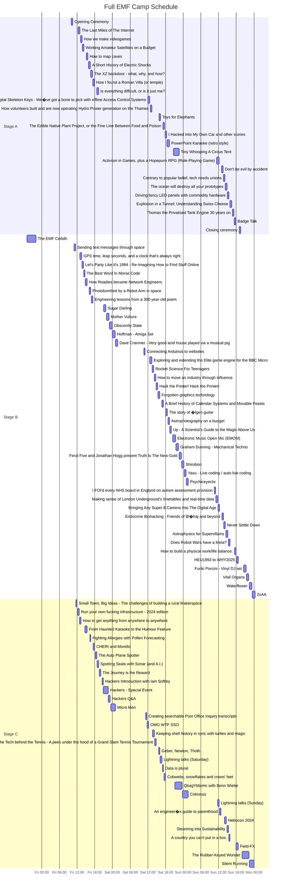

```mermaid
gantt
    title Full EMF Camp Schedule
    dateFormat YYYY-MM-DD HH:mm
    axisFormat %a %H:%M
    section Stage A
      Opening Ceremony  :2024-05-31 10:00, 30m
      The Last Miles of The Internet  :2024-05-31 12:20, 40m
      How we make videogames  :2024-05-31 13:10, 30m
      Working Amateur Satellites on a Budget  :2024-05-31 13:50, 30m
      How to map caves  :2024-05-31 15:10, 30m
      A Short History of Electric Shocks  :2024-05-31 15:50, 40m
      The XZ backdoor - what, why, and how?  :2024-05-31 16:40, 30m
      How I found a Roman Villa (or temple)  :2024-05-31 17:20, 30m
      Is everything difficult, or is it just me?  :2024-05-31 18:40, 40m
      Digital Skeleton Keys - We�ve got a bone to pick with offline Access Control Systems  :2024-06-01 12:00, 40m
      How volunteers built and are now operating Hydro Power generation on the Thames  :2024-06-01 12:50, 30m
      Toys for Elephants  :2024-06-01 15:50, 30m
      The Edible Native Plant Project, or the Fine Line Between Food and Poison  :2024-06-01 17:10, 30m
      I Hacked Into My Own Car and other stories  :2024-06-01 17:50, 30m
      PowerPoint Karaoke (retro style)  :2024-06-01 18:30, 50m
      Tiny Whooping A Circus Tent  :2024-06-01 20:40, 120m
      Activism in Games, plus a Hopepunk RPG (Role-Playing Game)  :2024-06-02 11:20, 50m
      Don't be evil by accident  :2024-06-02 13:00, 30m
      Contrary to popular belief, tech needs unions  :2024-06-02 13:40, 30m
      The ocean will destroy all your prototypes  :2024-06-02 14:20, 30m
      Driving fancy LED panels with commodity hardware  :2024-06-02 15:00, 30m
      Explosion in a Tunnel; Understanding Swiss Cheese  :2024-06-02 15:50, 40m
      Thomas the Privatised Tank Engine 30 years on  :2024-06-02 16:40, 30m
      Badge Talk  :2024-06-02 17:20, 30m
      Closing ceremony  :2024-06-02 19:00, 30m
    section Stage B
      The EMF Ceilidh  :2024-05-30 19:00, 180m
      Sending text messages through space  :2024-05-31 11:00, 30m
      GPS time, leap seconds, and a clock that's always right  :2024-05-31 13:00, 30m
      Let's Party Like It's 1994 - Re-Imagining How to Find Stuff Online  :2024-05-31 13:40, 30m
      The Best Word In Morse Code  :2024-05-31 14:20, 20m
      How Roadies became Network Engineers   :2024-05-31 14:50, 30m
      Photobombed by a Robot Arm in space  :2024-05-31 16:10, 30m
      Engineering lessons from a 300 year-old poem    :2024-05-31 16:50, 30m
      Sugar Darling  :2024-05-31 21:00, 45m
      Mother Vulture  :2024-05-31 22:00, 50m
      Obscenity State  :2024-05-31 23:00, 55m
      Hoffman - Amiga Set  :2024-06-01 00:00, 55m
      Dave Cranmer - Very good acid house played via a musical pig  :2024-06-01 01:00, 45m
      Connecting Arduinos to websites  :2024-06-01 10:40, 20m
      Exploring and extending the Elite game engine for the BBC Micro  :2024-06-01 12:40, 40m
      Rocket Science For Teenagers  :2024-06-01 13:30, 30m
      How to move an industry through influence  :2024-06-01 14:10, 30m
      Hack the Printer! Hack the Printer!  :2024-06-01 14:50, 30m
      Forgotten graphics technology  :2024-06-01 15:30, 30m
      A Brief History of Calendar Systems and Movable Feasts  :2024-06-01 16:50, 30m
      The story of �lgen guitar  :2024-06-01 18:10, 30m
      Astrophotography on a budget  :2024-06-01 18:50, 30m
      Up - A Scientist's Guide to the Magic Above Us  :2024-06-01 19:30, 30m
      Electronic Music Open Mic (EMOM)  :2024-06-01 20:30, 55m
      Graham Dunning - Mechanical Techno  :2024-06-01 21:30, 55m
      Feral Five and Jonathan Hogg present Truth Is The New Gold   :2024-06-01 22:40, 40m
      Shirobon  :2024-06-01 23:30, 45m
      Yaxu - Live coding / auto-live coding  :2024-06-02 00:20, 40m
      Psychiceyeclix   :2024-06-02 01:05, 40m
      I FOI'd every NHS board in England on autism assessment provision  :2024-06-02 10:40, 20m
      Making sense of London Underground's timetables and real-time data  :2024-06-02 11:10, 30m
      Bringing Any Super 8 Camera Into The Digital Age  :2024-06-02 11:50, 30m
      Endocrine Biohacking - Friends of Bl�haj and beyond  :2024-06-02 13:10, 30m
      Never Settle Down  :2024-06-02 13:50, 30m
      Astrophysics for Supervillains  :2024-06-02 14:30, 40m
      Does Robot Wars have a Meta?   :2024-06-02 15:20, 30m
      How to build a physical work/life balance.  :2024-06-02 17:30, 30m
      HEU1993 to WHY2025  :2024-06-02 18:10, 30m
      Funki Porcini - Vinyl DJ set  :2024-06-02 20:30, 55m
      Vital Organs  :2024-06-02 21:30, 40m
      Waterflower  :2024-06-02 22:25, 55m
      2xAA  :2024-06-02 23:30, 55m
    section Stage C
      Small Town, Big Ideas - The challenges of building a rural Makerspace  :2024-05-31 11:40, 20m
      Run your own fucking infrastructure - 2024 edition  :2024-05-31 12:10, 30m
      How to get anything from anywhere to anywhere  :2024-05-31 12:50, 30m
      From Haunted Karaoke to the Humour Feature  :2024-05-31 14:40, 40m
      Fighting Allergies with Pollen Forecasting  :2024-05-31 16:20, 20m
      CHERI and Morello  :2024-05-31 17:30, 30m
      The Auto Plane Spotter  :2024-05-31 18:10, 30m
      Spotting Seals with Sonar (and A.I.)  :2024-05-31 18:50, 30m
      The Journey is the Reward  :2024-05-31 19:30, 30m
      Hackers Introduction with Iain Softley  :2024-05-31 20:30, 20m
      Hackers - Special Event  :2024-05-31 20:50, 105m
      Hackers Q&A  :2024-05-31 22:35, 40m
      Micro Men  :2024-05-31 23:30, 95m
      Creating searchable Post Office Inquiry transcripts  :2024-06-01 11:20, 20m
      OMG WTF SSO  :2024-06-01 11:50, 30m
      Keeping shell history in sync with turtles and magic  :2024-06-01 13:40, 30m
      The Tech behind the Tennis - A peek under the hood of a Grand Slam Tennis Tournament  :2024-06-01 14:20, 30m
      Geber, Newton, Thoth  :2024-06-01 15:40, 20m
      Lightning talks  (Saturday)  :2024-06-01 16:10, 40m
      Data is plural  :2024-06-01 17:00, 20m
      Cobwebs, snowflakes and crows' feet  :2024-06-01 17:30, 30m
      QbagYbbxHc with Benn Wiebe  :2024-06-01 21:10, 145m
      Colossus  :2024-06-01 23:45, 115m
      Lightning talks  (Sunday)  :2024-06-02 11:40, 30m
      An engineer�s guide to parenthood  :2024-06-02 12:20, 30m
      Hebocon 2024  :2024-06-02 14:00, 40m
      Steaming into Sustainability  :2024-06-02 14:50, 30m
      A country you can't put in a box.  :2024-06-02 15:30, 20m
      Field-FX  :2024-06-02 18:00, 40m
      The Rubber-Keyed Wonder  :2024-06-02 20:00, 140m
      Silent Running  :2024-06-02 22:30, 90m
```