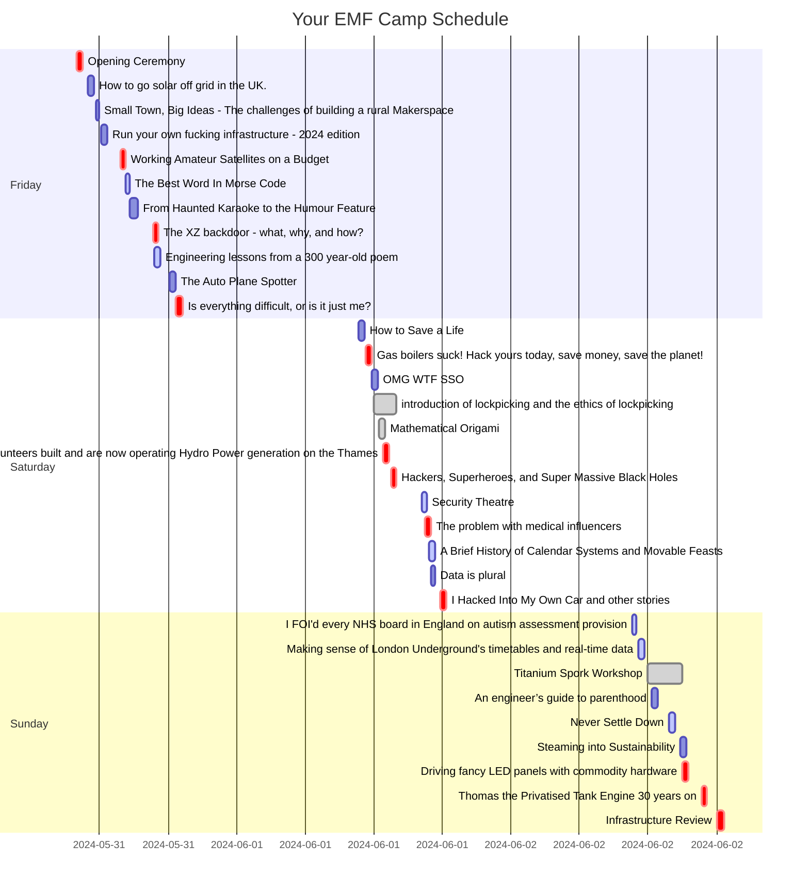

```mermaid
gantt
    title Your EMF Camp Schedule
    dateFormat YYYY-MM-DD HH:mm
    section Friday
      Opening Ceremony  :crit, 2024-05-31 10:00, 30m
      How to go solar off grid in the UK.   :2024-05-31 11:00, 30m
      Small Town, Big Ideas - The challenges of building a rural Makerspace  :2024-05-31 11:40, 20m
      Run your own fucking infrastructure - 2024 edition  :2024-05-31 12:10, 30m
      Working Amateur Satellites on a Budget  :crit, 2024-05-31 13:50, 30m
      The Best Word In Morse Code  :active, 2024-05-31 14:20, 20m
      From Haunted Karaoke to the Humour Feature  :2024-05-31 14:40, 40m
      The XZ backdoor - what, why, and how?  :crit, 2024-05-31 16:40, 30m
      Engineering lessons from a 300 year-old poem    :active, 2024-05-31 16:50, 30m
      The Auto Plane Spotter  :2024-05-31 18:10, 30m
      Is everything difficult, or is it just me?  :crit, 2024-05-31 18:40, 40m
    section Saturday
      How to Save a Life  :2024-06-01 10:40, 30m
      Gas boilers suck! Hack yours today, save money, save the planet!   :crit, 2024-06-01 11:20, 30m
      OMG WTF SSO  :2024-06-01 11:50, 30m
      introduction of lockpicking and the ethics of lockpicking  :done, 2024-06-01 12:00, 120m
      Mathematical Origami  :done, 2024-06-01 12:30, 30m
      How volunteers built and are now operating Hydro Power generation on the Thames  :crit, 2024-06-01 12:50, 30m
      Hackers, Superheroes, and Super Massive Black Holes  :crit, 2024-06-01 13:30, 30m
      Security Theatre  :active, 2024-06-01 16:10, 30m
      The problem with medical influencers  :crit, 2024-06-01 16:30, 30m
      A Brief History of Calendar Systems and Movable Feasts  :active, 2024-06-01 16:50, 30m
      Data is plural  :2024-06-01 17:00, 20m
      I Hacked Into My Own Car and other stories  :crit, 2024-06-01 17:50, 30m
    section Sunday
      I FOI'd every NHS board in England on autism assessment provision  :active, 2024-06-02 10:40, 20m
      Making sense of London Underground's timetables and real-time data  :active, 2024-06-02 11:10, 30m
      Titanium Spork Workshop  :done, 2024-06-02 12:00, 180m
      An engineer’s guide to parenthood  :2024-06-02 12:20, 30m
      Never Settle Down  :active, 2024-06-02 13:50, 30m
      Steaming into Sustainability  :2024-06-02 14:50, 30m
      Driving fancy LED panels with commodity hardware  :crit, 2024-06-02 15:00, 30m
      Thomas the Privatised Tank Engine 30 years on  :crit, 2024-06-02 16:40, 30m
      Infrastructure Review  :crit, 2024-06-02 18:00, 40m
```